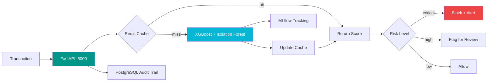

<p align="center">
  
  
  
  
  
</p>

## ⚡ How It Works

Transactions flow through a multi-layer detection pipeline in under 20ms:

```
┌─────────────┐     ┌──────────────┐     ┌─────────────┐     ┌──────────┐
│  Transaction │────▶│   Feature     │────▶│  Ensemble    │────▶│  Decision │
│    Ingest     │     │  Engineering  │     │   Scoring    │     │  Engine   │
└─────────────┘     └──────────────┘     └─────────────┘     └──────────┘
                            │                     │                    │
                     ┌──────┴──────┐       ┌────┴────┐          ┌───┴───┐
                     │ Redis Cache │       │ XGBoost  │          │ Alert │
                     │  < 1ms      │       │ IsoForest│          │ Queue │
                     └─────────────┘       └─────────┘          └───────┘
```

## 🔥 Key Features

- **Sub-20ms latency** — Feature extraction + ensemble scoring in single pass
- **SMOTE-balanced training** — Handles 99:1 fraud-to-legit ratio
- **Velocity checks** — Detects rapid successive transactions
- **Device fingerprinting** — Cross-references known compromised devices
- **Explainable decisions** — Every score comes with feature contributions

## 🧪 Quick Run

```bash
# Spin up the full stack (API + Redis + PostgreSQL + MLflow)
docker compose up -d

# Score a single transaction
curl -X POST http://localhost:8000/api/v1/score/transaction \
  -H "Content-Type: application/json" \
  -d '{"transaction_id":"TX-00123456","amount":450.00,"merchant_category":"retail",
       "customer_id":"C-9876","device_fingerprint":"a1b2c3d4","ip_address":"192.168.1.1"}'

# Batch score 100 transactions from a CSV pipeline
curl -X POST http://localhost:8000/api/v1/score/batch \
  -d @transactions.json
```

## 📋 API Reference

| Endpoint | Method | Description |
|:--|:--|:--|
| `/api/v1/score/transaction` | POST | Real-time single-transaction scoring |
| `/api/v1/score/batch` | POST | Bulk fraud screening (up to 1K txns) |
| `/api/v1/alerts/recent` | GET | Fetch recent fraud alerts |
| `/api/v1/stats/dashboard` | GET | Fraud statistics dashboard |
| `/api/v1/health` | GET | System health + model status |

## 🧬 Pipeline Architecture



## 🏗️ Infrastructure

| Service | Purpose |
|:--|:--|
| **FastAPI** (8000) | Async scoring API |
| **Redis** (6379) | Transaction cache + rate limiting |
| **PostgreSQL** (5432) | Audit trail + model metrics |
| **MLflow** (5000) | Experiment tracking |

## 📈 Model Performance

| Detector | AUC-ROC | Avg Latency |
|:--|--:|--:|
| XGBoost Fraud Classifier | 0.97 | 12ms |
| Isolation Forest Anomaly | 0.89 | 5ms |
| Behavioral Velocity Check | 0.84 | 2ms |

---

<p align="center">
  <b>Mahesh Solanki</b> · 
  <a href="https://linkedin.com/in/maheshsolanki-16b9a6a5">LinkedIn</a> ·
  <a href="https://github.com/twomathematicians-code">GitHub</a>
</p>
